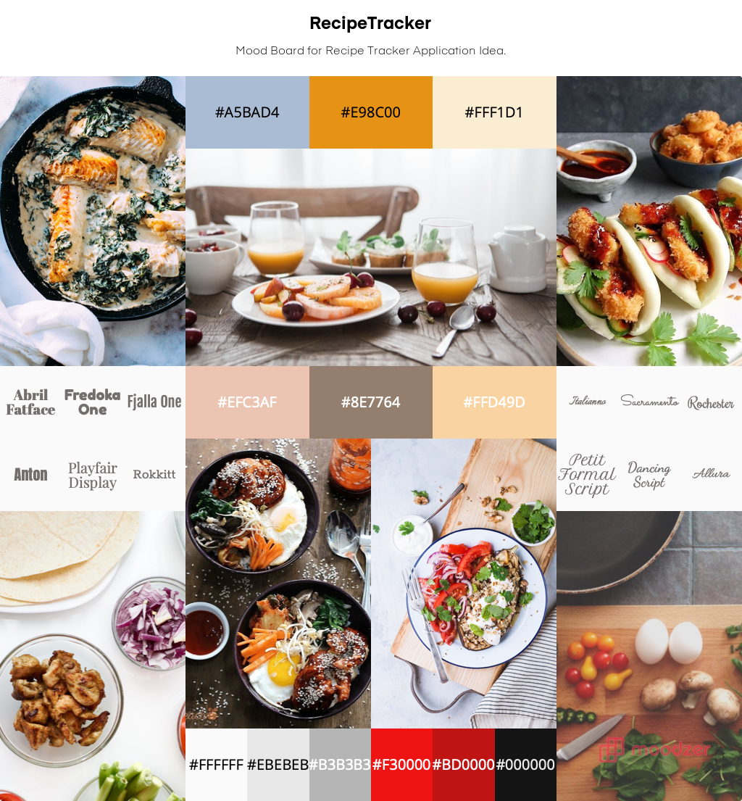

# Recipe Tracker Mood Board 

## What is Recipe Tracker?
Recipe Tracker is a concept idea for a website/application in which you would be able to use pre install recipes and add your own, ask for recipes based on what type of food you are craving, tell you when you last cooked a certain recipe, add ingredients to shopping your shopping list, price ingredients as per your shop preference online prices and will calculate the calories per recipe and serve to inform.

## Mood Board

This Mood Board was created to display a collection of design elements to possibly be implemented if made.

